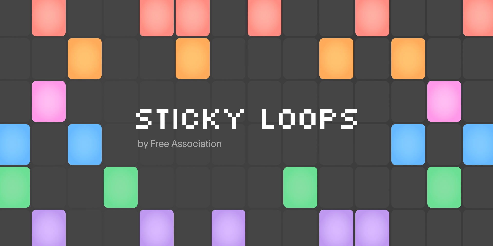

# Sticky Loops

> What does a brainstorm really sound like?

The answer is here! Sticky Loops takes the sticky notes in a FigJam file and tranforms them into an awesome drum machine. Useful for...

- Daily scrum concerts
- Priotizing ideas by downbeat
- Metronome-based design and concepting
- General distraction
- and much more...!

Instructions

1. Open a FigJam file
2. Select some sticky notes
3. Run the `Sticky Loops` plugin
4. Listen to your work!

---

Made @ [Free Association](https://www.freeassociation.com)

Are you passionate about building creative tools and improving the designer experience? Join us! We help teams at the world's top enterprises and startups level-up with customized design systems, applications, automation and more.

[https://www.freeassociation.com/careers](https://www.freeassociation.com/careers)

---
